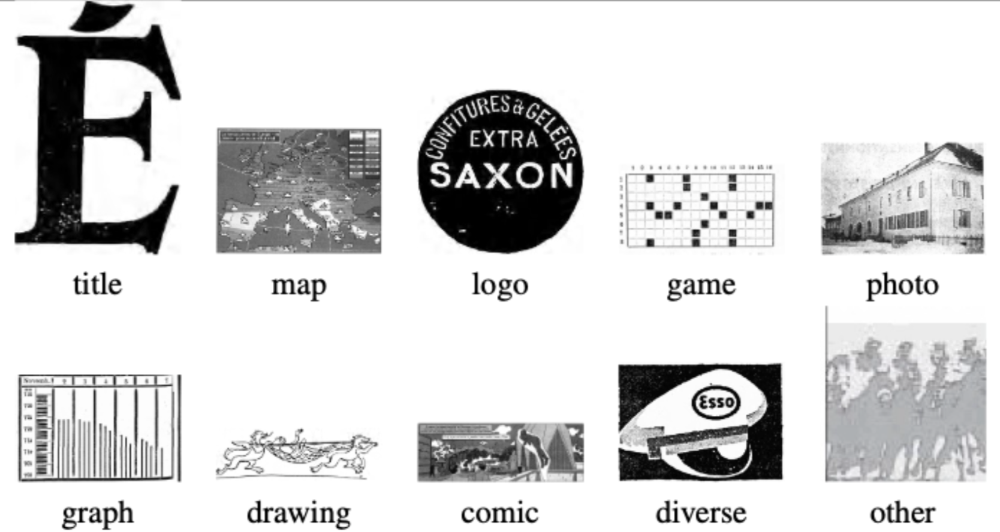

# Exploring Large Vision-Language Pre-trained Models for Historical Images Classification and Captioning

## OVERVIEW

_Context_: The impresso project features a dataset of around 90 digitised historical newspapers containing approximately 3 million images. These images have no labels, and only 10% of them have a caption, two aspects that hinder their retrieval.
Two previous student projects focused on the automatic classification of these images, trying to identify 1. the type of image (e.g. photograph, illustration, drawing, graphic, cartoon, map), and 2. in the case of maps, the country or region of the world represented on that map. Good performances on image type classification were achieved by fine-tuning the VGG-16 pre-trained model (see report).

## Image examples from the test dataset

## GOALS

_Objective_: On the basis of these initial experiments and the annotated dataset compiled on this occasion, the present project will explore recent large-scale language-vision pre-trained models. Specifically, the project will attempt to:

- Evaluate zero-shot image type classification of the available dataset using the CLIP and Flamingo Multi-modal models, and compare with previous performances;
- Explore and evaluate image captioning of the same dataset, including trying to identify countries or regions of the world. This part will require adding caption information on the test part of the dataset. In addition to the fluency and accuracy of the generated captions, a specific aspect that might be taken into account is distinctiveness, i.e. whether the image contains details that differentiate it from similar images.

## **Usage:**

The scripts must be run outside of CLIP/ or FLAMINGO/, i.e from dhlab-image-captioning/  

CLIP:

- To run the test_clip.py, execute the following command in your terminal:  

`python3 CLIP/test_clip.py`

- The argument options are:  

- - Experiment with different prompts to enter in the class_descriptions variable  
    `python3 CLIP/test_clip.py --clip`
- - When wanting to save the results obtained with particular prompts, the csv will be stored in the directory spec-paraph-results  
    `python3 CLIP/test_clip.py --clip --create_csv <filename.csv> <type-of-change>`
- - When wanting to load a csv file, this command will print the report, and display the confusion matrix and f1 scores  
    `python3 CLIP/test_clip.py --load_csv <file_path>`
- - Opens the list of desired images from the test data, specified inside the image_paths variable  
    `python3 CLIP/test_clip.py --open_images`

- To run the test_languages.py, execute the following command in your terminal, adjusting the main() as needed:  
- - python3 CLIP/test_languages.py  

FLAMINGO:

- To test flamingo, run the test_flam.py, execute the following command in your terminal:  

`python3 FLAMINGO/test_flam.py`

- The required and optional arguments are:  

- - Number of shots from 0 to 3, and prompt ID from 1 to 4 for classification and 1 to 3 for captioning. For the list of Prompt IDs, refer to the variables CLASS_PROMPT_LIST and CAP_PROMPT_LIST (required)  
`--num_shots <num_shots> --prompt_id <prompt_id>`

- - If the desired task is classification, omit this argument. If it is captioning, add this argument. (classification task by default)  
`--caption`

- To post-process results of a classification prompt, execute the following command in your terminal. It saves the plots inside the corresponding prompt folder.  
`python3 FLAMINGO/post-process.py --folder_path <folder_path>`

- Perform a quantitative analysis of the results running the following command:  
`python3 FLAMINGO/quantitative-analysis.py`

- Generate one HTML file per class displaying the results of a specific csv result file  
`python3 FLAMINGO/single-file-summary.py`

- Generate 2 HTMLs files that displays the results of all captioning prompts and all classification prompts, respectively:  
`python3 FLAMINGO/overview-summaries.py`

## **Student:**

Ines Bouchama

## **Supervisers:**

Emanuela Boros
Maud Ehrmann
